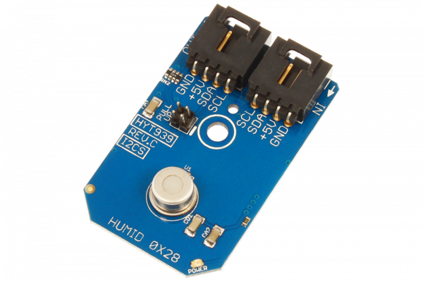

[](https://store.ncd.io/product/hyt939-humidity-and-temperature-sensor-%C2%B11-8rh-%C2%B10-2c-i2c-mini-module/).

# HYT939

This sensor is not for everyone because of it’s high cost, but if you need the best of the best Temperature and Humidity Sensor money can buy, look no further as few sensors can compare to this gem. Precisely calibrated, the HYT939 delivers an accuracy of ±1.8 % RH and ±0.2 °C. Integrated signal processing is used for measuring the physical parameters of relative humidity and temperature using a convenient I2C interface.
This Device is available from www.ncd.io

[SKU: HYT939]

(https://store.ncd.io/product/hyt939-humidity-and-temperature-sensor-%C2%B11-8rh-%C2%B10-2c-i2c-mini-module/)
This Sample code can be used with Raspberry Pi.

Hardware needed to interface HYT939 humidity and temperature sensor With Raspberry Pi :

1. <a href="https://store.ncd.io/product/hyt939-humidity-and-temperature-sensor-%C2%B11-8rh-%C2%B10-2c-i2c-mini-module/">HYT939 humidity and temperature Sensor</a>

2. <a href="https://store.ncd.io/product/i2c-shield-for-raspberry-pi-3-pi2-with-outward-facing-i2c-port-terminates-over-hdmi-port/">Raspberry Pi I2C Shield</a>

3. <a href="https://store.ncd.io/product/i%C2%B2c-cable/">I2C Cable</a>

## Python

Download and install smbus library on Raspberry pi. Steps to install smbus are provided at:

https://pypi.python.org/pypi/smbus-cffi/0.5.1

Download (or git pull) the code in pi. Run the program.

```cpp
$> python HYT939.py
```
The lib is a sample library, you will need to calibrate the sensor according to your application requirement.
